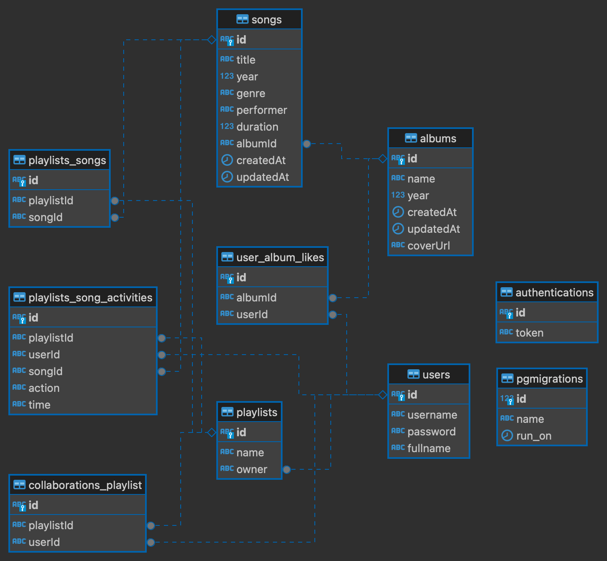

# openmusic

Opendiscuss is a community platform where people contribute to discuss various topics.

## User Stories

You can find user stories in the file [README-user-story.md](README-user-story.md).

## Entiry Relationship Diagram




## Quick Start


1. Rename `.env-example` to `.env`.

2. Run the POSTGRES database and the Go app using Docker Compose:

```shell
sudo docker compose up --build
```

POSTGRES credentials is:

```
DB_USER="postgres"
DB_PASSWORD="root"
DB_HOST="localhost"
DB_PORT="5439"
DB_NAME="open_Music"
```

Test hit API login:

```shell
curl --location 'http://localhost:8080/authentications' \
--header 'Content-Type: application/json' \
--data '{
    "username": "admin",
    "password": "admin"
}'
```

Check [README-user-story.md](README-user-story.md) for other API.

## API Documentation

For API documentation, you can import the file [postman/opendiscuss.postman_collection.json](postman/opendiscuss.postman_collection.json) into your Postman.
